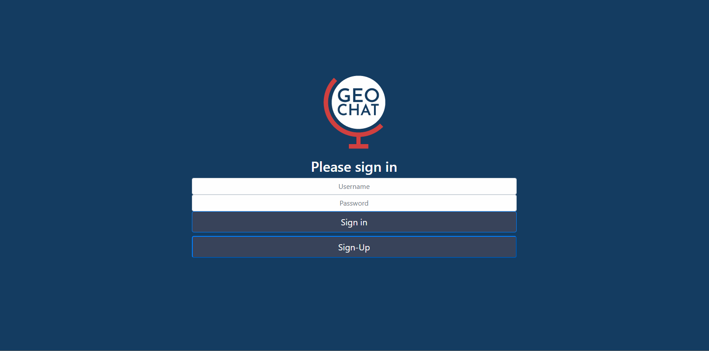

# Geo-Chats
Messaging chatroom application that allows users of a similar region to communicate in region-locked chatrooms as well as share their current location.

Deployed here: https://ma662.github.io/Geo-Chats/login.html

## Technologies:
- HTML5
- CSS
- Bootstrap
- Google Maps API
- Firebase Realtime Database

Credits:
- Myles Alcala - Project Lead, Back-End (database management, repository management, integrations, user authentication, Google Maps API)
- Tristan Martin - Front-End
- Robert Steinkopf - Back-End 